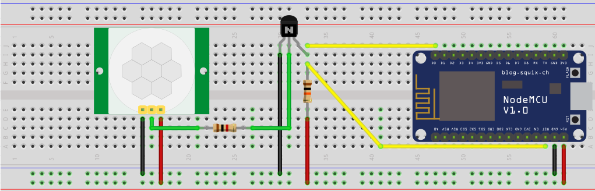

# motion-sensor
IOT Battery operated PIR Sensor

The NodeMCU Multisensor remixed from a sensor by Bruh Automation led me to create a simple motion sensor that can be run on an 18650 battery for months if not years. Using a Nodemcu v1.0 and making use of its deep sleep capability minimizes power usage only triggering a wifi connection and notifications after motion, then going back into a deep sleep.

Parts:
- Nodemcu Development board
- PIR Sensor
- 18650 Battery
- Some wires
- Blynk account
- 1k resistor
- 10k resistor
- 2N222 NPN Transistor

3D printed enclosure can be downloaded from thingiverse, https://www.thingiverse.com/thing:2784417
